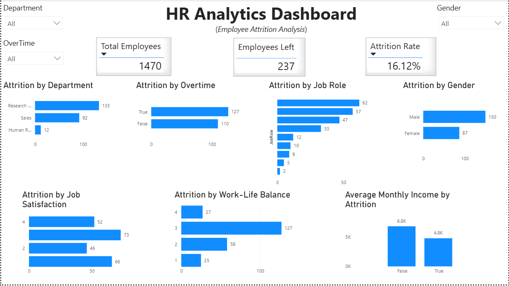

HR Analytics Dashboard | Power BI

Dashboard Preview

Overview

This project is an interactive  "HR Analytics Dashboard" built using Power BI to analyze employee attrition. The dashboard provides key insights into workforce trends, employee turnover, and factors that influence attrition.

Objectives

* Analyze overall employee attrition.
* Identify departments and job roles with the highest attrition.
* Compare attrition based on overtime, gender, job satisfaction, and work-life balance.
* Analyze the relationship between monthly income and employee attrition.

Tools & Technologies

* Power BI
* SQL Server
* DAX (Data Analysis Expressions)
* Microsoft Excel / CSV

Key Metrics

* Total Employees
* Employees Left
* Attrition Rate
* Average Monthly Income

Dashboard Visualizations

* Attrition by Department
* Attrition by Overtime
* Attrition by Job Role
* Attrition by Gender
* Attrition by Job Satisfaction
* Attrition by Work-Life Balance
* Average Monthly Income by Attrition

Interactive Features

* Department Slicer
* Gender Slicer
* Overtime Slicer

Business Insights

* The overall attrition rate is **16.12%**.
* Employees working overtime show higher attrition than those who do not.
* Sales Representatives and Laboratory Technicians experience comparatively higher attrition.
* Employees with lower average monthly income tend to have higher attrition.
* Research & Development has the highest number of employee exits due to its larger workforce.

Project Files

* HR Analytics Dashboard.pbix
* EmployeeAttrition.csv
* HR_Analytics_SQL.sql

Skills Demonstrated

* Data Cleaning
* Data Modeling
* SQL Queries
* DAX Measures
* KPI Cards
* Interactive Dashboards
* Data Visualization
* Business Analysis

